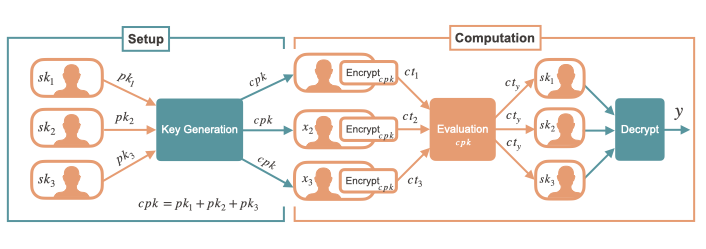

# Helium

Helium is a versatile secure multiparty computation framework based on multiparty homomorphic encryption (MHE). 
It uses the [Lattigo library](https://github.com/tuneinsight/lattigo) for the M(HE) operation and [gRPC](https://grpc.io/) for its service and network layer.

## MHE-based MPC

The framework enables a group of N parties to compute a joint function of their private inputs under encryption and to release the result to a designated receiver.
Helium currently supports the MHE scheme and associated MPC protocol described in the paper ["Multiparty Homomorphic Encryption from Ring-Learning-With-Errors"](https://eprint.iacr.org/2020/304.pdf) along with its extension to t-out-of-N-threshold encryption described in ["An Efficient Threshold Access-Structure for RLWE-Based Multiparty Homomorphic Encryption"](https://eprint.iacr.org/2022/780.pdf). These schemes provide security against passive attackers that can corrupt up to t-1 of the input parties and can operate in various system models such as peer-to-peer, cloud-assisted or hybrid architecture.

The protocol consists in 2 main phases, the **Setup** phase and the **Computation** phase, as illustrated in the diagram below. 
The Setup phase is independent of the inputs and can be performed "offline".
Its goal is to generate a collective public-key for which decryption requires collaboration among a parameterizable threshold number of parties.
In the Computation phase, the parties provide their inputs encrypted under the generated collective key.
Then, the circuit is homomorphically evaluated and the output is collaboratively re-encrypted to the receiver secret-key.

## Features

The framework currently supports the following features:

* Access-structure:
  - N-out-of-N-threshold setup phase
  - t-out-of-N-threshold setup phase

* Schemes:
  - BFV
  - BGV
  - CKKS

* System models:
  - Peer-to-peer
  - Cloud-assisted (thin clients)
  - Hybrids

## Repository overview

* `api`: Remote procedure call definition (`.proto`) files.
* `apps`: standalone applications.
* `apps/node`: go application for a single, standalone Helium node
* `deployment`: deployment-related files.
* `deployment/test-local`: a docker-based local deployment for test purposes.
* `pkg`: all supporting Go packages
* `test`: test-related configuration files and data. 

## Architecture overview
A party in the Helium framework is a node (`node.Node` type) and is identified by a unique identifier `utils.NodeID`.
Interactions between the nodes are done through remote procedure calls (RPCs), and follow a REST-like semantic.
Hence, nodes can be both client and server for other nodes, and the framework functions are provided by services.

### Services
Helium provide the following services:
* [SetupService](/pkg/services/setup/service.go): handles the Setup phase of the MHE-MPC protocol.
* [ComputeService](/pkg/services/compute/service.go): handles the computation phase the MHE-MPC protocol. (WIP)
* [ManageService](/pkg/services/manage/service.go): handles interactions that are not related to the MHE-MPC protocol

### Sessions
Transversal to all the services is the notion of session (`session.Session`). A session is the context for the computation and represents the persistent state of the parties in the MHE-based MPC protocol.
It notably holds:
- the MHE cryptographic parameters
- the information on the other nodes
- the secret-key of the party
- the various public-keys

(WIP) Sessions are created by the `ManageService`, their cryptographic material is initialized by the `SetupService` and they are then used as a computation context by the `ComputeService`.

### Node types

**Full vs Light**. Helium nodes can be either "full" or "light". A full node is instantiated with a bindable network address and exposes a server for each of the service.
Light nodes are instantiated without a bindable address and can only communicate with other node by calling their API (hence, can only directly communicate with full nodes).
This means that at least one full node is required in the system.
Nodes interact with full nodes by actively querying them for their inputs in the protocol (using GET-like API endpoints),
and with light-nodes by passively waiting for them to provide their inputs (using PUT-like API endpoints). 

**Internal vs External**. A Helium node is internal when it is part of the access-structure for the session's secret-key and is external otherwise.
External parties can assist a set of internal parties in the execution of the MHE-MPC protocol by aggregating their public shares and evaluating homomorphic circuits over their inputs.

#### Cloud-assisted setting
The canonical cloud-assisted MHE-MPC protocol is instantiated by running all the input parties as light nodes and provide them with an external helper party running a full node "in the cloud".

#### Peer-to-peer setting
The traditional peer-to-peer MPC setting corresponds to running all input parties as full-nodes without assistance from external parties.
